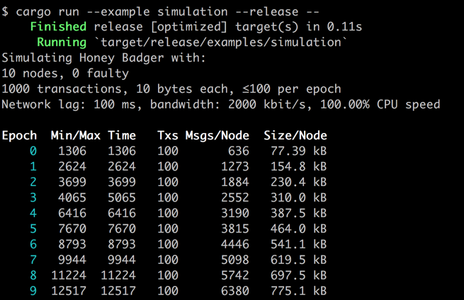

# POA ballot stats

POA ballot stats is a command line tool that displays voting statistics for the [POA network](https://poa.network/). The ability to monitor voting records is essential to maintaining POA network integrity. Ballot proposals change the network state, and all network participants have a right to view and understand the potential impacts of these changes. 

Validators on the network engage in active governance, managing their roles and creating on-chain consensus. This is achieved through a balloting process. 

1.	A ballot is created by an existing validator.
2.	The ballot remains open for a minimum of 48 hours (exact length of time is determined on ballot creation). During this open period, validators are expected to investigate, discuss and perform due diligence before placing their vote. 
3.	When the time period expires, the ballot is closed. No more votes are allowed.
4.	A ballot is finalized by a validator, and the results are submitted to the network. Any validator can finalize a closed ballot.

Additional information on [ballot types and limits](https://github.com/poanetwork/wiki/wiki/Ballots-Overview.-Life-cycle-and-limits)

Additional information on the [Validator role](https://github.com/poanetwork/wiki/wiki/Role-of-Validator)

Ballot tracking provides transparency for POA token holders and promotes validator accountability. The poa-ballot-stats tool runs on the command line and displays POA network validator voting participation. Each validator is shown by order of missed votes. Results are not shown from validators who have been removed from the network. 

The default display includes:
- non-participation/associated ballots
- missed %
- truncated voting key
- truncated mining key
- first name last name

## Screenshot

Add new screenshot here




# Dependencies
Prior to downloading poa-ballot-stats you must install and activate a fully syncronized node connected to the POA network.
**Note:** synchronization can take several hous depending on connection speed. See the [POA installation guide](https://github.com/poanetwork/wiki/wiki/POA-Installation)
**Note:** poa-ballot-stats must access the full network logs. Use these flags when running a node --pruning=archive --no-warp

Example:

```bash
$ parity --chain c:\path\to\spec.json --reserved-peers c:\path\to\bootnodes.txt --pruning=archive --no-warp
```

# Usage

## Stable Release

Download the archive for your platform from the latest [release](https://github.com/poanetwork/poa-ballot-stats/releases) and unpack it. Run the tool with `./poa-ballot-stats <options>`.

You can view the command line options with `-h`, and specify a different endpoint if your node e.g.
uses a non-standard port. By default, it tries to connect to a local node `http://127.0.0.1:8545`.

In verbose mode, with `-v`, the list of collected ballot and key change events is displayed, and for each ballot the list of participating and abstaining voters.

The `-c` option takes a map with the POA contracts' addresses in JSON format. You can find the 
current maps for the main and test network the `contracts` folder. By default, it uses `core.json`,
for the main network.

The `-p` option takes a time interval in hours, days, months, etc. E.g. `-p "10 weeks"` will only count participation in ballots that were created within the last 10 weeks. Alternatively, instead of a _time_, you can specify the earliest block _number_ as a decimal integer with the `-b` option.


## Examples

Examples:

```bash
$ ./poa-ballot-stats -h
$ ./poa-ballot-stats
$ ./poa-ballot-stats https://core.poa.network -v -p "10 weeks"
$ ./poa-ballot-stats -c contracts/sokol.json https://sokol.poa.network -v
```

## Latest code

If you have a recent version of [Rust](https://www.rust-lang.org/), you can clone this repository and use `cargo run --` instead of `./poa-ballot-stats` to compile and run the latest version of the code.

# Troubleshooting

## No Events Found error

1.	Parity must be fully synced to the correct node and running in full mode, not "light" mode. Check Parity UI and/or Task Manager to confirm Parity is synced and actively connected to peers.

2.	The correct network must be selected in Parity. The Parity UI will show the current network selection in green. Make sure this is the correct network, and not the Foundation or other Etherium network.


3. If running Parity on the Sokol test network, check that you are connecting to the Sokol network using the -c flag on cargo run.

# Contribute

Future implementations may include the number of yes/no votes for each validator and other data points. Proposed requirements and notes on this issue are described in RFC9 [Statistics of ballots](https://github.com/poanetwork/RFC/issues/9).

## To Contribute
1. Fork the repository
https://github.com/poanetwork/poa-ballot-stats/fork
2. Create a feature branch
3. Write tests to cover the work 
4. Commit changes
5. Push to the branch
6. Create a new pull request following the PR protocol below

## Pull Request (PR) Protocol

All pull requests must include: 
* A clear, readable description of the purpose of the PR
* A clear, readable description of changes
* A title that includes (Fix), (Feature), or (Refactor)
**example:** (Fix) price of 1 token in Wei > 18 decimals
* A single commit message for one specific fix or feature. A separate PR should be made for each specific change.
* Any additional concerns or comments (optional)

All accepted and completed PRs are updated in the Wiki documentation.
